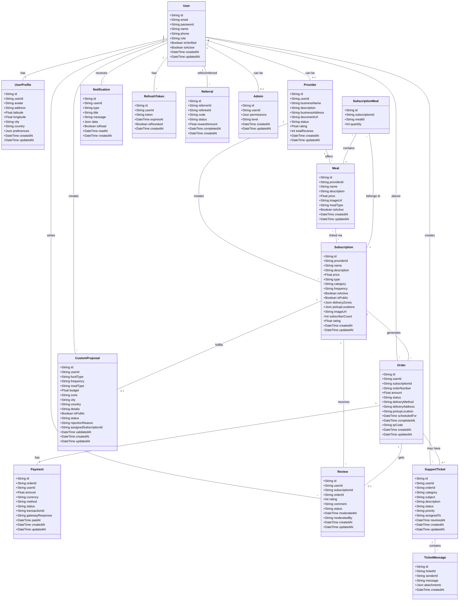

# Diagramme de Classes & Modèle de Données - Juna

## 1. Diagramme de Classes (Vue d'Ensemble)



---

## 2. Schéma Prisma Complet

```prisma
// prisma/schema.prisma

generator client {
  provider = "prisma-client-js"
}

datasource db {
  provider = "postgresql"
  url      = env("DATABASE_URL")
}

// ============================================
// ENUMS
// ============================================

enum UserRole {
  USER
  PROVIDER
  ADMIN
  SUPER_ADMIN
}

enum OrderStatus {
  PENDING
  CONFIRMED
  PREPARING
  READY
  IN_DELIVERY
  DELIVERED
  COMPLETED
  CANCELLED
  REFUNDED
}

enum PaymentStatus {
  PENDING
  PROCESSING
  SUCCESS
  FAILED
  REFUNDED
}

enum PaymentMethod {
  MOBILE_MONEY_WAVE
  MOBILE_MONEY_MTN
  MOBILE_MONEY_MOOV
  MOBILE_MONEY_ORANGE
  CARD
  CASH
}

enum DeliveryMethod {
  DELIVERY
  PICKUP
}

enum SubscriptionFrequency {
  DAILY
  THREE_PER_WEEK
  WEEKLY
  BIWEEKLY
  MONTHLY
}

enum MealType {
  BREAKFAST
  LUNCH
  DINNER
  SNACK
}

enum SubscriptionType {
  BREAKFAST
  LUNCH
  DINNER
  SNACK
  BREAKFAST_LUNCH
  BREAKFAST_DINNER
  LUNCH_DINNER
  FULL_DAY
  CUSTOM
}

enum SubscriptionCategory {
  AFRICAN
  EUROPEAN
  ASIAN
  AMERICAN
  FUSION
  VEGETARIAN
  VEGAN
  HALAL
  OTHER
}

enum ProposalStatus {
  PENDING
  REVIEWING
  APPROVED
  REJECTED
}

enum ReviewStatus {
  PENDING
  APPROVED
  REJECTED
}

enum ProviderStatus {
  PENDING
  APPROVED
  REJECTED
  SUSPENDED
}

enum TicketStatus {
  OPEN
  IN_PROGRESS
  RESOLVED
  CLOSED
  ESCALATED
}

enum TicketPriority {
  LOW
  MEDIUM
  HIGH
  URGENT
}

enum TicketCategory {
  PAYMENT
  DELIVERY
  QUALITY
  TECHNICAL
  ACCOUNT
  OTHER
}

enum NotificationType {
  ORDER_CONFIRMATION
  ORDER_PREPARING
  ORDER_READY
  ORDER_DELIVERED
  PAYMENT_SUCCESS
  PAYMENT_FAILED
  PROPOSAL_VALIDATED
  PROPOSAL_REJECTED
  REVIEW_PUBLISHED
  TICKET_RESPONSE
  SUBSCRIPTION_EXPIRING
  SUBSCRIPTION_RENEWED
  REFERRAL_REWARD
  SYSTEM
}

enum ReferralStatus {
  PENDING
  COMPLETED
  EXPIRED
}

// ============================================
// MODELS
// ============================================

model User {
  id            String        @id @default(uuid())
  email         String        @unique
  password      String
  name          String
  phone         String?       @unique
  role          UserRole      @default(USER)
  isVerified    Boolean       @default(false)
  isActive      Boolean       @default(true)
  createdAt     DateTime      @default(now())
  updatedAt     DateTime      @updatedAt

  // Relations
  profile       UserProfile?
  provider      Provider?
  admin         Admin?
  orders        Order[]
  payments      Payment[]
  proposals     CustomProposal[]
  reviews       Review[]
  tickets       SupportTicket[]
  notifications Notification[]
  refreshTokens RefreshToken[]
  referrals     Referral[]     @relation("Referrer")
  referredBy    Referral[]     @relation("Referee")
  ticketMessages TicketMessage[]

  @@index([email])
  @@index([phone])
  @@map("users")
}

model UserProfile {
  id          String    @id @default(uuid())
  userId      String    @unique
  avatar      String?
  address     String?
  latitude    Float?
  longitude   Float?
  city        String?
  country     String?
  preferences Json?     // JSON: { dietaryRestrictions: [], favoriteCategories: [], ... }
  createdAt   DateTime  @default(now())
  updatedAt   DateTime  @updatedAt

  // Relations
  user        User      @relation(fields: [userId], references: [id], onDelete: Cascade)

  @@map("user_profiles")
}

model Provider {
  id              String          @id @default(uuid())
  userId          String          @unique
  businessName    String
  description     String?         @db.Text
  businessAddress String
  documentUrl     String?
  status          ProviderStatus  @default(PENDING)
  rating          Float           @default(0)
  totalReviews    Int             @default(0)
  createdAt       DateTime        @default(now())
  updatedAt       DateTime        @updatedAt

  // Relations
  user            User            @relation(fields: [userId], references: [id], onDelete: Cascade)
  subscriptions   Subscription[]
  meals           Meal[]

  @@index([status])
  @@map("providers")
}

model Meal {
  id          String    @id @default(uuid())
  providerId  String
  name        String
  description String    @db.Text
  price       Float
  imageUrl    String?
  mealType    MealType
  isActive    Boolean   @default(true)
  createdAt   DateTime  @default(now())
  updatedAt   DateTime  @updatedAt

  // Relations
  provider    Provider              @relation(fields: [providerId], references: [id], onDelete: Cascade)
  mealsInSubscriptions SubscriptionMeal[]

  @@index([providerId])
  @@index([mealType])
  @@map("meals")
}

model Subscription {
  id               String             @id @default(uuid())
  providerId       String
  name             String
  description      String             @db.Text
  price           Float
  type             SubscriptionType
  category         SubscriptionCategory
  frequency        SubscriptionFrequency
  isActive         Boolean            @default(true)
  isPublic         Boolean            @default(true)
  deliveryZones    Json?
  pickupLocations  Json?
  imageUrl         String?
  subscriberCount  Int                @default(0)
  rating           Float              @default(0)
  createdAt        DateTime           @default(now())
  updatedAt        DateTime           @updatedAt

  // Relations
  provider         Provider                @relation(fields: [providerId], references: [id], onDelete: Cascade)
  orders           Order[]
  reviews          Review[]
  proposals        CustomProposal[]
  mealsInSubscriptions SubscriptionMeal[]

  @@index([providerId])
  @@index([type])
  @@index([category])
  @@index([frequency])
  @@index([isActive])
  @@index([isPublic])
  @@map("subscriptions")
}

model SubscriptionMeal {
  id             String      @id @default(uuid())
  subscriptionId String
  mealId         String
  quantity       Int         @default(1)

  // Relations
  subscription   Subscription @relation(fields: [subscriptionId], references: [id], onDelete: Cascade)
  meal           Meal        @relation(fields: [mealId], references: [id], onDelete: Cascade)

  @@unique([subscriptionId, mealId])
  @@map("subscription_meals")
}

model Order {
  id              String          @id @default(uuid())
  userId          String
  subscriptionId  String
  orderNumber     String          @unique  // Ex: "ORD-2025-001234"
  amount          Float
  status          OrderStatus     @default(PENDING)
  deliveryMethod  DeliveryMethod
  deliveryAddress String?         // Si delivery
  pickupLocation  String?         // Si pickup (JSON stringified)
  scheduledFor    DateTime?       // Date/heure prévue
  completedAt     DateTime?
  qrCode          String?         @unique  // Pour le retrait
  metadata        Json?           // Infos supplémentaires
  createdAt       DateTime        @default(now())
  updatedAt       DateTime        @updatedAt

  // Relations
  user            User            @relation(fields: [userId], references: [id])
  subscription    Subscription    @relation(fields: [subscriptionId], references: [id])
  payment         Payment?
  review          Review?
  tickets         SupportTicket[]

  @@index([userId])
  @@index([subscriptionId])
  @@index([status])
  @@index([orderNumber])
  @@map("orders")
}

model Payment {
  id              String        @id @default(uuid())
  orderId         String        @unique
  userId          String
  amount          Float
  currency        String        @default("XOF")  // Franc CFA
  method          PaymentMethod
  status          PaymentStatus @default(PENDING)
  transactionId   String?       @unique  // ID de la transaction externe
  gatewayResponse Json?         // Réponse complète du gateway
  paidAt          DateTime?
  createdAt       DateTime      @default(now())
  updatedAt       DateTime      @updatedAt

  // Relations
  order           Order         @relation(fields: [orderId], references: [id], onDelete: Cascade)
  user            User          @relation(fields: [userId], references: [id])

  @@index([userId])
  @@index([status])
  @@index([transactionId])
  @@map("payments")
}

model CustomProposal {
  id                    String         @id @default(uuid())
  userId                String
  foodType              String         // Ex: "Africaine", "Européenne"
  frequency             String         // Ex: "Quotidien", "3x/semaine"
  mealType              MealType
  budget                Float
  zone                  String         // Zone géographique
  city                  String
  country               String
  details               String?        @db.Text  // Détails supplémentaires
  isPublic              Boolean        @default(false)
  status                ProposalStatus @default(PENDING)
  rejectionReason       String?        @db.Text
  assignedSubscriptionId String?       @unique  // Si validé et abonnement créé
  validatedAt           DateTime?
  createdAt             DateTime       @default(now())
  updatedAt             DateTime       @updatedAt

  // Relations
  user                  User           @relation(fields: [userId], references: [id], onDelete: Cascade)
  subscription          Subscription?  @relation(fields: [assignedSubscriptionId], references: [id])

  @@index([userId])
  @@index([status])
  @@map("custom_proposals")
}

model Review {
  id              String       @id @default(uuid())
  userId          String
  subscriptionId  String
  orderId         String       @unique
  rating          Int          // 1 à 5
  comment         String?      @db.Text
  status          ReviewStatus @default(PENDING)
  moderatedAt     DateTime?
  moderatedBy     String?      // userId de l'admin
  createdAt       DateTime     @default(now())
  updatedAt       DateTime     @updatedAt

  // Relations
  user            User         @relation(fields: [userId], references: [id], onDelete: Cascade)
  subscription    Subscription @relation(fields: [subscriptionId], references: [id], onDelete: Cascade)
  order           Order        @relation(fields: [orderId], references: [id], onDelete: Cascade)

  @@index([userId])
  @@index([subscriptionId])
  @@index([status])
  @@map("reviews")
}

model SupportTicket {
  id          String          @id @default(uuid())
  userId      String
  orderId     String?         // Optionnel si lié à une commande
  category    TicketCategory
  subject     String
  description String          @db.Text
  status      TicketStatus    @default(OPEN)
  priority    TicketPriority  @default(MEDIUM)
  assignedTo  String?         // userId de l'admin assigné
  resolvedAt  DateTime?
  createdAt   DateTime        @default(now())
  updatedAt   DateTime        @updatedAt

  // Relations
  user        User            @relation(fields: [userId], references: [id], onDelete: Cascade)
  order       Order?          @relation(fields: [orderId], references: [id])
  messages    TicketMessage[]

  @@index([userId])
  @@index([status])
  @@index([category])
  @@map("support_tickets")
}

model TicketMessage {
  id          String        @id @default(uuid())
  ticketId    String
  senderId    String        // userId (peut être user ou admin)
  message     String        @db.Text
  attachments Json?         // URLs de fichiers joints
  createdAt   DateTime      @default(now())

  // Relations
  ticket      SupportTicket @relation(fields: [ticketId], references: [id], onDelete: Cascade)
  sender      User          @relation(fields: [senderId], references: [id])

  @@index([ticketId])
  @@map("ticket_messages")
}

model Notification {
  id        String           @id @default(uuid())
  userId    String
  type      NotificationType
  title     String
  message   String           @db.Text
  data      Json?            // Données supplémentaires (orderId, etc.)
  isRead    Boolean          @default(false)
  readAt    DateTime?
  createdAt DateTime         @default(now())

  // Relations
  user      User             @relation(fields: [userId], references: [id], onDelete: Cascade)

  @@index([userId])
  @@index([isRead])
  @@map("notifications")
}

model RefreshToken {
  id        String   @id @default(uuid())
  userId    String
  token     String   @unique  @db.Text
  expiresAt DateTime
  isRevoked Boolean  @default(false)
  createdAt DateTime @default(now())

  // Relations
  user      User     @relation(fields: [userId], references: [id], onDelete: Cascade)

  @@index([userId])
  @@index([token])
  @@map("refresh_tokens")
}

model Referral {
  id            String         @id @default(uuid())
  referrerId    String
  refereeId     String?        // Null si le filleul ne s'est pas encore inscrit
  code          String         @unique
  status        ReferralStatus @default(PENDING)
  rewardAmount  Float          @default(0)
  completedAt   DateTime?
  createdAt     DateTime       @default(now())

  // Relations
  referrer      User           @relation("Referrer", fields: [referrerId], references: [id], onDelete: Cascade)
  referee       User?          @relation("Referee", fields: [refereeId], references: [id])

  @@index([referrerId])
  @@index([code])
  @@map("referrals")
}

model Admin {
  id          String   @id @default(uuid())
  userId      String   @unique
  permissions Json?    // JSON: { canModerateReviews: true, canManageUsers: true, ... }
  level       String   @default("ADMIN")  // "ADMIN" ou "SUPER_ADMIN"
  createdAt   DateTime @default(now())
  updatedAt   DateTime @updatedAt

  // Relations
  user        User     @relation(fields: [userId], references: [id], onDelete: Cascade)

  @@map("admins")
}

// ============================================
// TABLES SUPPLÉMENTAIRES (Optionnelles v2)
// ============================================

// Table pour logs d'activité admin
model AdminLog {
  id        String   @id @default(uuid())
  adminId   String
  action    String   // Ex: "USER_BANNED", "PROPOSAL_APPROVED"
  targetId  String?  // ID de l'entité concernée
  details   Json?
  createdAt DateTime @default(now())

  @@index([adminId])
  @@index([action])
  @@map("admin_logs")
}

// Table pour analytics
model Analytics {
  id        String   @id @default(uuid())
  date      DateTime
  metric    String   // Ex: "NEW_USERS", "TOTAL_ORDERS", "REVENUE"
  value     Float
  metadata  Json?
  createdAt DateTime @default(now())

  @@unique([date, metric])
  @@index([date])
  @@index([metric])
  @@map("analytics")
}
```

---

## 3. Description Détaillée des Entités

### 3.1. User
**Rôle** : Entité centrale représentant tous les utilisateurs de la plateforme

**Attributs principaux** :
- `role` : USER | PROVIDER | ADMIN | SUPER_ADMIN
- `isVerified` : Email vérifié ou non
- `isActive` : Compte actif ou suspendu/banni

**Relations** :
- 1 UserProfile (informations complémentaires)
- 0..1 Provider (si l'user est fournisseur)
- 0..1 Admin (si l'user est admin)
- N Orders, Reviews, Proposals, Tickets, Notifications

---

### 3.2. UserProfile
**Rôle** : Informations complémentaires du profil utilisateur

**Attributs principaux** :
- `address`, `latitude`, `longitude` : Pour la géolocalisation
- `preferences` : JSON avec préférences alimentaires, catégories favorites, etc.

---

### 3.3. Provider
**Rôle** : Informations spécifiques aux fournisseurs de repas

**Attributs principaux** :
- `status` : PENDING | APPROVED | REJECTED | SUSPENDED
- `rating` : Note moyenne calculée depuis les reviews
- `totalReviews` : Nombre total d'avis

**Relations** :
- N Subscriptions (abonnements créés par le fournisseur)

---

### 3.4. Subscription
**Rôle** : Abonnement de nourriture proposé par un fournisseur

**Attributs principaux** :
- `category` : AFRICAN | EUROPEAN | ASIAN | etc.
- `frequency` : DAILY | WEEKLY | MONTHLY | etc.
- `mealType` : BREAKFAST | LUNCH | DINNER | etc.
- `isPublic` : true si visible par tous, false si privé (issu d'une proposition)
- `deliveryZones` : JSON définissant les zones de livraison
- `pickupLocations` : JSON définissant les points de retrait

**Relations** :
- N Orders (commandes générées)
- N Reviews (avis reçus)

---

### 3.5. Order
**Rôle** : Commande/souscription d'un utilisateur à un abonnement

**Attributs principaux** :
- `orderNumber` : Numéro unique (ex: ORD-2025-001234)
- `status` : PENDING | CONFIRMED | PREPARING | DELIVERED | etc.
- `deliveryMethod` : DELIVERY | PICKUP
- `qrCode` : Code QR unique pour le retrait
- `scheduledFor` : Date/heure prévue de livraison/retrait

**Relations** :
- 1 Payment (paiement associé)
- 0..1 Review (avis laissé)
- 0..N SupportTickets (tickets de support liés)

---

### 3.6. Payment
**Rôle** : Transaction de paiement

**Attributs principaux** :
- `method` : MOBILE_MONEY_WAVE | CARD | etc.
- `status` : PENDING | SUCCESS | FAILED | REFUNDED
- `transactionId` : ID de la transaction externe (Wave, Stripe, etc.)
- `gatewayResponse` : Réponse complète du gateway de paiement (JSON)

---

### 3.7. CustomProposal
**Rôle** : Proposition d'abonnement personnalisé par un utilisateur

**Attributs principaux** :
- `status` : PENDING | REVIEWING | APPROVED | REJECTED
- `isPublic` : Si true, l'abonnement sera public une fois validé
- `rejectionReason` : Raison du rejet (si status = REJECTED)
- `assignedSubscriptionId` : ID de l'abonnement créé (si validé)

---

### 3.8. Review
**Rôle** : Avis laissé par un utilisateur sur un abonnement

**Attributs principaux** :
- `rating` : Note de 1 à 5
- `status` : PENDING | APPROVED | REJECTED (modération)
- `moderatedBy` : ID de l'admin ayant modéré

---

### 3.9. SupportTicket
**Rôle** : Ticket de support client

**Attributs principaux** :
- `category` : PAYMENT | DELIVERY | QUALITY | TECHNICAL | etc.
- `priority` : LOW | MEDIUM | HIGH | URGENT
- `status` : OPEN | IN_PROGRESS | RESOLVED | CLOSED | ESCALATED
- `assignedTo` : ID de l'admin assigné

**Relations** :
- N TicketMessages (historique des échanges)

---

### 3.10. Notification
**Rôle** : Notifications push/email envoyées aux utilisateurs

**Attributs principaux** :
- `type` : ORDER_CONFIRMATION | PAYMENT_SUCCESS | etc.
- `data` : JSON contenant des infos supplémentaires (orderId, etc.)
- `isRead` : Lue ou non

---

### 3.11. RefreshToken
**Rôle** : Tokens de rafraîchissement JWT

**Attributs principaux** :
- `token` : JWT hash
- `expiresAt` : Date d'expiration
- `isRevoked` : Révoqué ou non (pour déconnexion)

---

### 3.12. Referral
**Rôle** : Parrainage entre utilisateurs

**Attributs principaux** :
- `code` : Code unique de parrainage
- `status` : PENDING | COMPLETED | EXPIRED
- `rewardAmount` : Montant de la récompense

---

### 3.13. Admin
**Rôle** : Informations spécifiques aux administrateurs

**Attributs principaux** :
- `permissions` : JSON définissant les permissions granulaires
- `level` : ADMIN | SUPER_ADMIN

---

## 4. Contraintes & Validations

### 4.1. Au Niveau Base de Données
- ✅ `email` : unique, format email
- ✅ `phone` : unique si fourni
- ✅ `orderNumber` : unique
- ✅ `qrCode` : unique
- ✅ `transactionId` : unique
- ✅ `referral.code` : unique

### 4.2. Au Niveau Application (Zod)
- ✅ `password` : min 8 caractères, 1 majuscule, 1 chiffre
- ✅ `rating` : entre 1 et 5
- ✅ `price`, `amount`, `budget` : positifs
- ✅ `email` : format valide
- ✅ `phone` : format international

---

## 5. Index pour Performance

**Index créés** :
- `users` : email, phone
- `providers` : status
- `subscriptions` : providerId, category, isActive, isPublic
- `orders` : userId, subscriptionId, status, orderNumber
- `payments` : userId, status, transactionId
- `custom_proposals` : userId, status
- `reviews` : userId, subscriptionId, status
- `support_tickets` : userId, status, category
- `ticket_messages` : ticketId
- `notifications` : userId, isRead
- `refresh_tokens` : userId, token
- `referrals` : referrerId, code

---

**FIN DU DIAGRAMME DE CLASSES** ✅