# 🗺️ Parcours Utilisateurs - Juna

## 1. Utilisateur Standard (User)

### 1.1. Parcours : Souscription à un Abonnement Existant

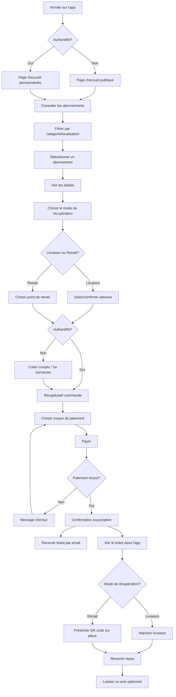

#### Étapes Détaillées

1. **Découverte**
   - L'utilisateur arrive sur l'application (web ou mobile)
   - Consultation libre des abonnements disponibles sans authentification
   - Filtrage par localisation (géolocalisation automatique ou saisie manuelle)
   - Tri par popularité, prix, nouveautés, catégories (Afrique, Europe, Asie, etc.)

2. **Sélection**
   - Clic sur un abonnement pour voir les détails complets :
     - Description du contenu
     - Durée (journalier, hebdomadaire, mensuel)
     - Prix
     - Zone de livraison / Points de retrait
     - Avis et notes des utilisateurs
     - Photos des repas

3. **Personnalisation**
   - Choix du mode de récupération :
     - **Livraison** : saisie/validation de l'adresse de livraison (avec géolocalisation)
     - **Retrait** : sélection d'un point de retrait disponible dans la liste

4. **Authentification (si nécessaire)**
   - Si l'utilisateur n'est pas connecté, redirection vers :
     - Création de compte (email, mot de passe, nom, téléphone, localisation)
     - Connexion (email + mot de passe)
     - Ou connexion via OAuth (Google, Facebook) - optionnel v2

5. **Paiement**
   - Récapitulatif de la commande
   - Choix du moyen de paiement :
     - Mobile Money (Wave, MTN, Moov, Orange Money)
     - Carte bancaire (Stripe)
   - Validation du paiement
   - Gestion des erreurs de paiement (solde insuffisant, carte expirée, etc.)

6. **Confirmation**
   - Page de confirmation avec numéro de commande
   - Réception d'un email contenant :
     - Récapitulatif de la souscription
     - Ticket numérique
     - QR code (si retrait sur place)
     - Détails de livraison ou d'accès au point de retrait
   - Ticket accessible dans le profil utilisateur

7. **Réception / Retrait**
   - **Si livraison** : 
     - Notification de préparation
     - Notification de départ du livreur (v2)
     - Suivi en temps réel (v2)
     - Réception du repas
   - **Si retrait** :
     - Présentation du QR code au point de retrait
     - Scan par le fournisseur
     - Récupération du repas

8. **Après-vente**
   - Invitation à laisser un avis (note + commentaire)
   - Possibilité de contacter le service client en cas de problème
   - Possibilité de renouveler l'abonnement

---

### 1.2. Parcours : Proposition d'Abonnement Personnalisé

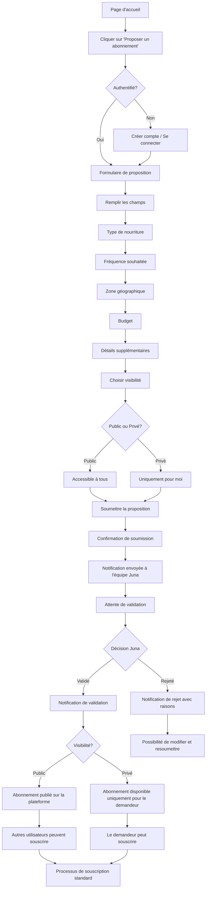

#### Étapes Détaillées

1. **Accès au formulaire**
   - Bouton "Proposer un abonnement personnalisé" visible sur la page d'accueil
   - Authentification obligatoire avant de remplir le formulaire

2. **Remplissage du formulaire**
   - **Type de nourriture** : africaine, européenne, asiatique, fusion, végétarienne, etc.
   - **Spécificités** : halal, végétarien, vegan, sans gluten, etc.
   - **Fréquence** : quotidien, 3x/semaine, hebdomadaire, mensuel
   - **Horaires préférés** : petit-déjeuner, déjeuner, dîner
   - **Zone géographique** : pays, ville, quartier
   - **Budget** : fourchette de prix souhaitée
   - **Nombre de personnes** : individuel ou groupe (famille, bureau)
   - **Détails supplémentaires** : préférences, allergies, instructions spéciales

3. **Choix de visibilité**
   - **Public** : la proposition, une fois validée, sera visible par tous les utilisateurs de la plateforme
   - **Privé** : seul le demandeur pourra souscrire à cet abonnement personnalisé

4. **Soumission**
   - Validation du formulaire (tous les champs obligatoires remplis)
   - Envoi de la proposition à l'équipe Juna
   - Notification par email de la soumission

5. **Traitement par Juna**
   - Analyse de la faisabilité (zone couverte, partenaires disponibles)
   - Vérification du budget
   - Contact éventuel de fournisseurs
   - Délai de réponse : 24-48h (à définir)

6. **Notification de décision**
   - **Si validé** :
     - Email/notification de validation
     - Proposition ajoutée à la plateforme (si publique) ou au profil (si privée)
     - Utilisateur peut procéder à la souscription
   - **Si rejeté** :
     - Email/notification avec raisons du rejet
     - Suggestions d'alternatives
     - Possibilité de modifier et resoumettre

7. **Souscription (si validé)**
   - Même processus que pour un abonnement standard
   - Paiement, confirmation, réception du ticket

---

### 1.3. Parcours : Gestion du Profil

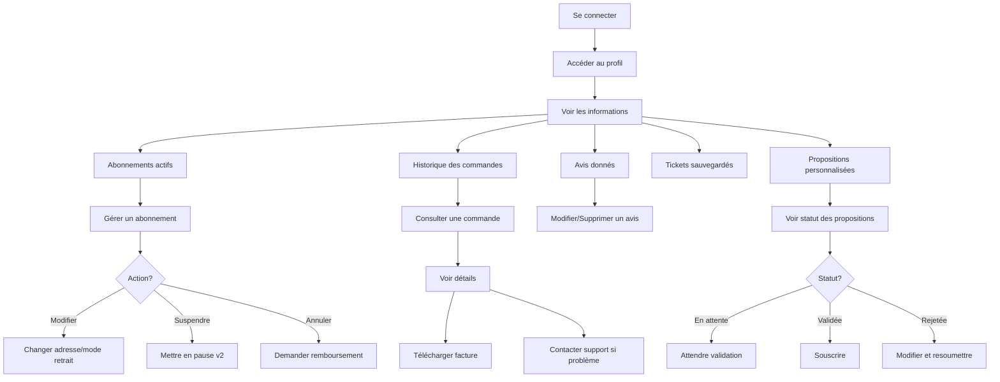

#### Fonctionnalités du Profil

1. **Informations personnelles**
   - Nom, email, téléphone, adresse(s)
   - Photo de profil (optionnel, v2)
   - Modification des informations
   - Changement de mot de passe

2. **Mes abonnements actifs**
   - Liste de tous les abonnements en cours
   - Détails de chaque abonnement (prochaine livraison, contenu, etc.)
   - Actions possibles : modifier, suspendre (v2), annuler

3. **Historique des commandes**
   - Liste chronologique de toutes les commandes passées
   - Statut (complétée, annulée, remboursée)
   - Possibilité de recommander un abonnement passé
   - Téléchargement des factures

4. **Mes avis**
   - Liste de tous les avis laissés
   - Modification/suppression possible (dans un délai défini)

5. **Mes tickets**
   - Tous les tickets numériques sauvegardés
   - QR codes pour les retraits
   - Historique des tickets utilisés

6. **Mes propositions personnalisées**
   - Statut de chaque proposition (en attente, validée, rejetée)
   - Possibilité de modifier les propositions rejetées
   - Souscrire aux propositions validées

7. **Préférences**
   - Notifications (email, push, SMS)
   - Préférences alimentaires par défaut
   - Langue
   - Zone de recherche par défaut

---

### 1.4. Parcours : Système d'Avis

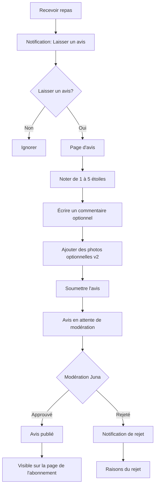

#### Étapes Détaillées

1. **Invitation à laisser un avis**
   - Après réception/retrait du repas
   - Notification push/email quelques heures après
   - Accessible aussi depuis le profil → Historique des commandes

2. **Rédaction de l'avis**
   - **Note obligatoire** : 1 à 5 étoiles
   - **Commentaire optionnel** : feedback textuel
   - **Photos optionnelles** (v2) : photos du repas reçu

3. **Modération**
   - Tous les avis sont modérés par l'équipe Juna avant publication
   - Critères de rejet :
     - Contenu offensant, injurieux
     - Spam, publicité
     - Hors sujet
   - Délai de modération : 24-48h

4. **Publication**
   - Avis approuvé affiché sur la page de l'abonnement
   - Contribue à la note globale
   - L'utilisateur peut modifier/supprimer son avis dans les 7 jours (par exemple)

---

### 1.5. Parcours : Service Client

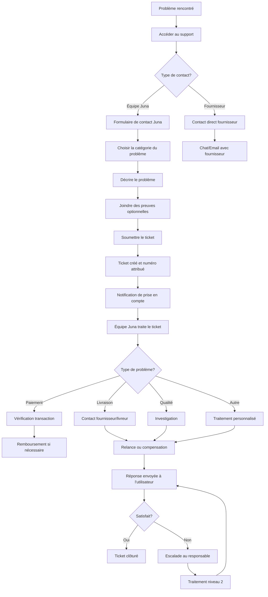

#### Types de Réclamations

1. **Problèmes de paiement**
   - Paiement non reconnu
   - Double prélèvement
   - Demande de remboursement

2. **Problèmes de livraison**
   - Livraison non reçue
   - Retard important
   - Adresse incorrecte

3. **Problèmes de qualité**
   - Repas non conforme
   - Problème d'hygiène
   - Quantité insuffisante

4. **Problèmes techniques**
   - Bug de l'application
   - QR code non reconnu
   - Problème de compte

5. **Autres**
   - Questions générales
   - Suggestions d'amélioration
   - Partenariats

---

## 2. Fournisseur de Repas (Provider)

### 2.1. Parcours : Inscription en tant que Fournisseur

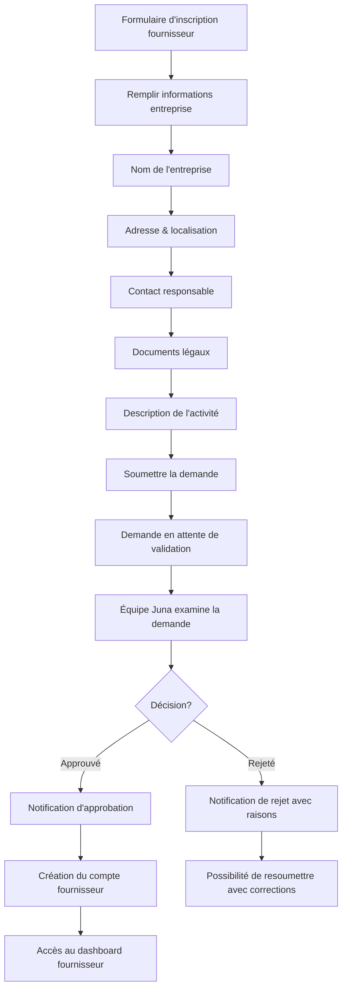

### 2.2. Parcours : Gestion des Abonnements (Fournisseur)

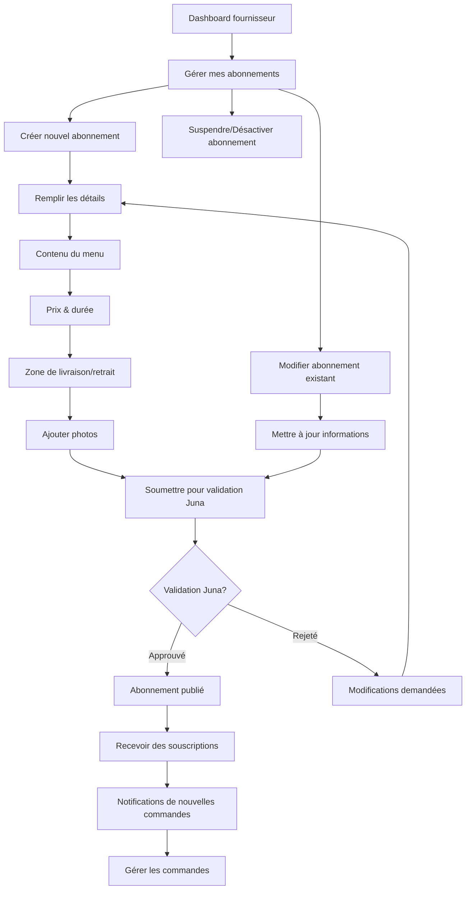

### 2.3. Parcours : Gestion des Commandes (Fournisseur)

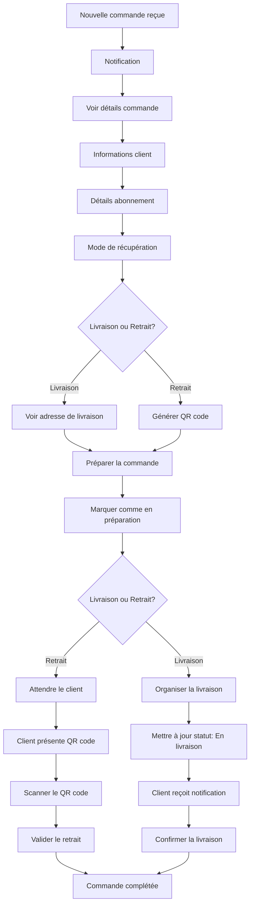

---

## 3. Administrateur (Admin)

### 3.1. Parcours : Validation des Propositions

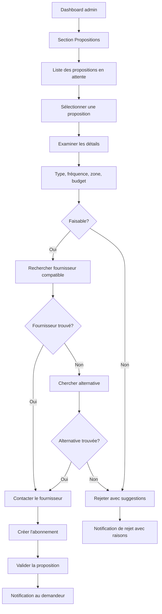

### 3.2. Parcours : Gestion des Utilisateurs

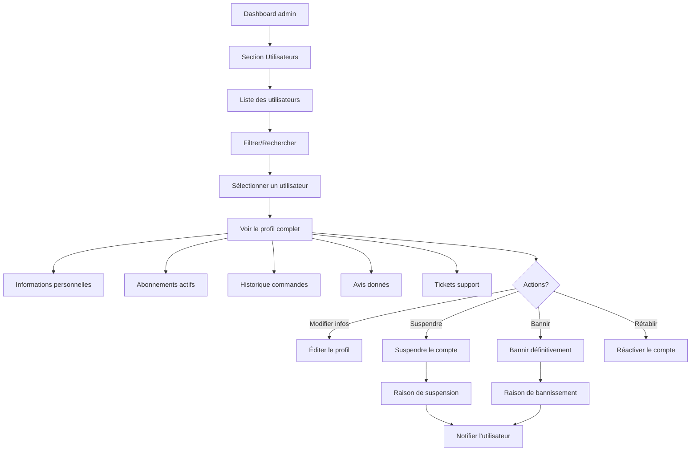

### 3.3. Parcours : Modération des Avis

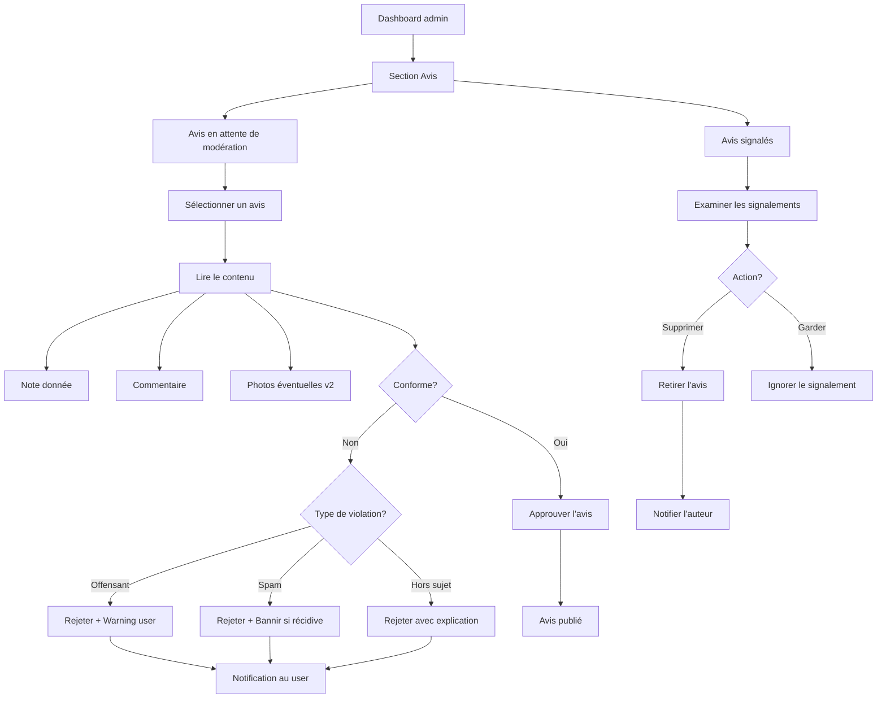

### 3.4. Parcours : Gestion des Tickets Support

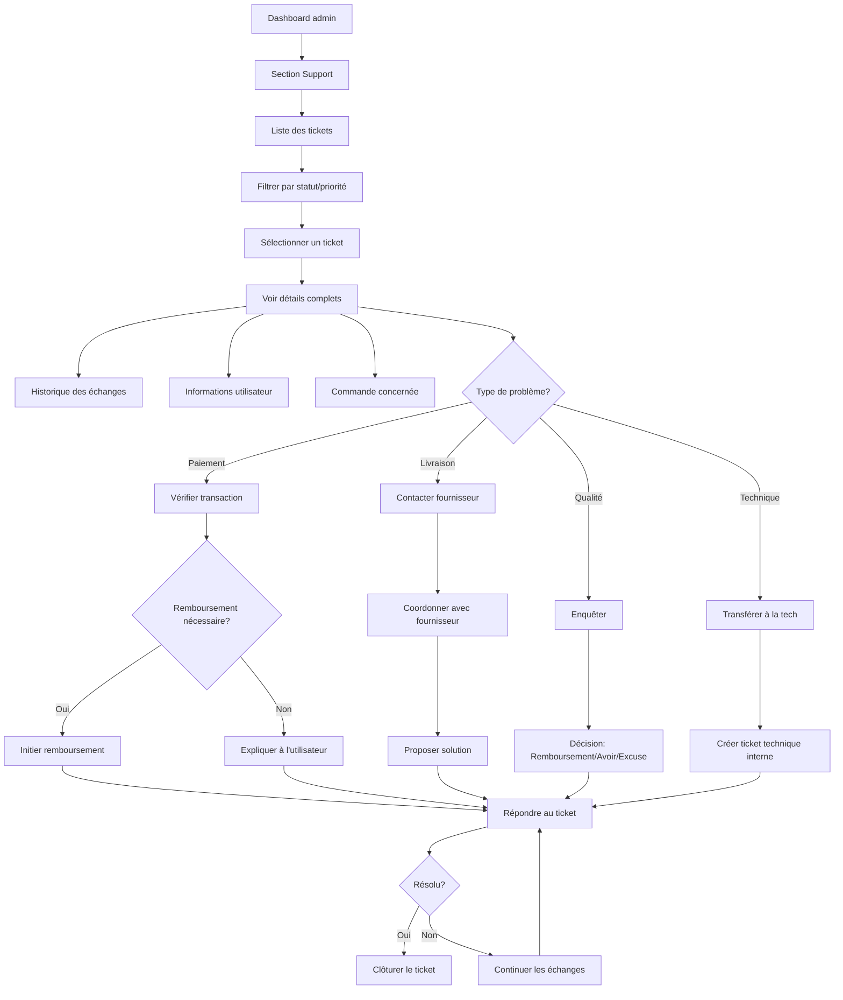

### 3.5. Parcours : Statistiques & Reporting

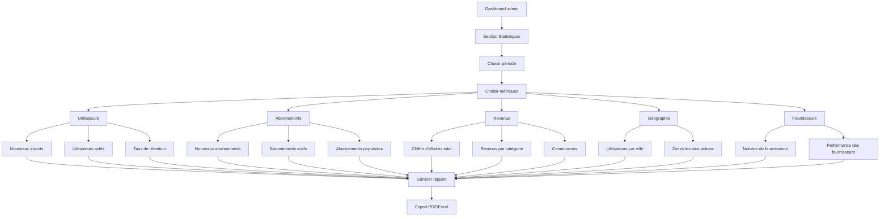

---

## 4. Super Admin

### 4.1. Parcours : Gestion des Administrateurs

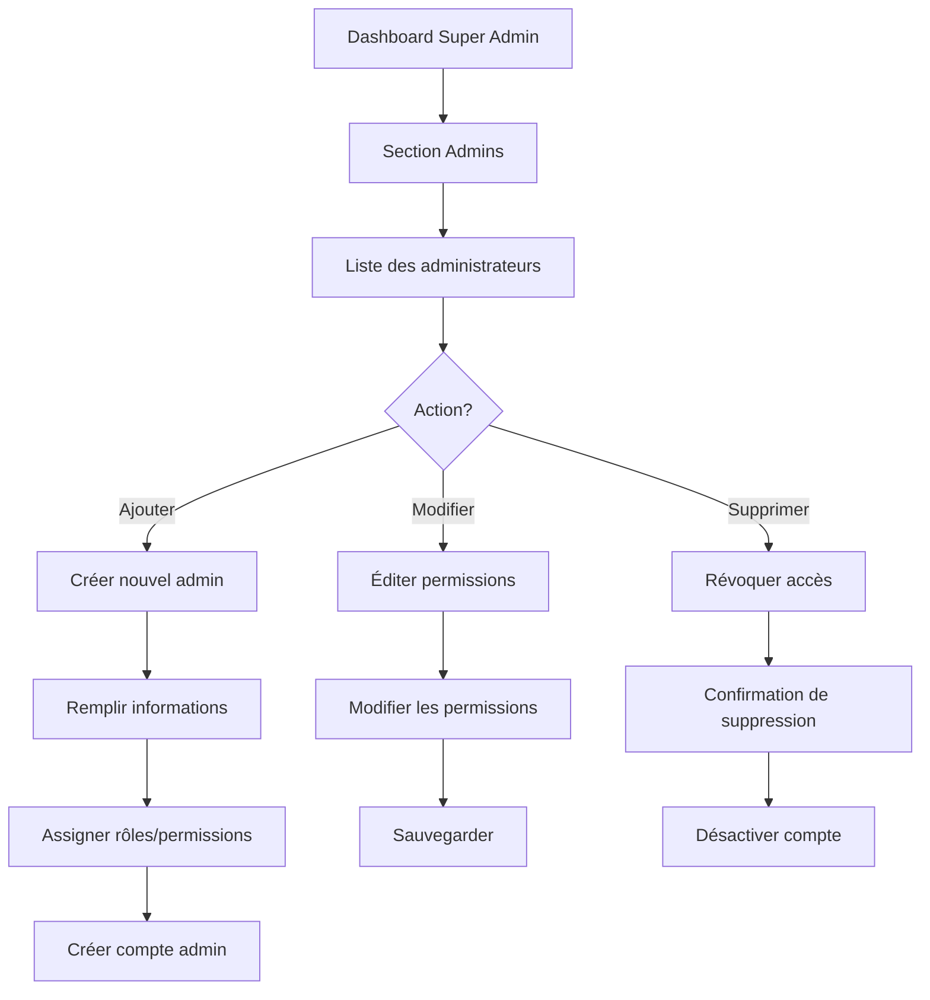

### 4.2. Parcours : Configuration de la Plateforme

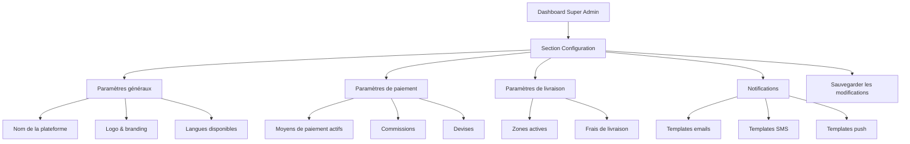

---

## 5. Cas d'Usage Spéciaux

### 5.1. Renouvellement Automatique d'Abonnement

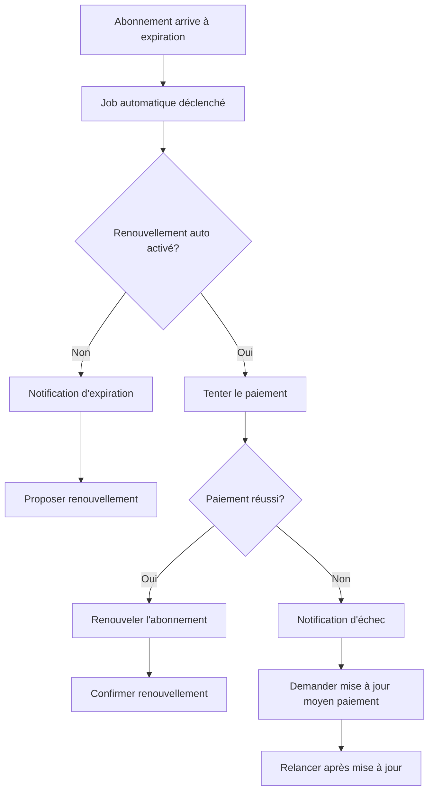

### 5.2. Annulation & Remboursement

```mermaid
graph TD
    A[Demande d'annulation] --> B[Vérifier conditions]
    
    B --> C{Dans délai d'annulation?}
    C -->|Oui| D[Calculer remboursement]
    C -->|Non| E[Refuser remboursement total]
    
    D --> F{Abonnement déjà utilisé?}
    F -->|Non| G[Rembours